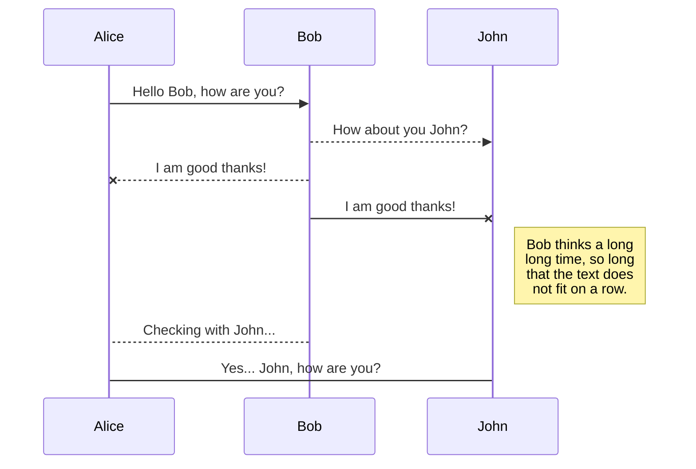
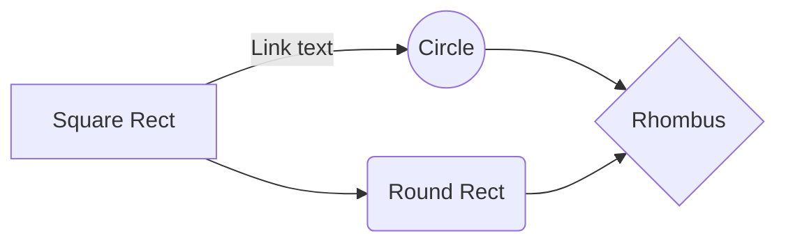

# GFX Artist
These markdowns are going to teach you how to work as a GFX Artist.
GFX Artist makes graphic effect like shaders, lighting, particle effects, etc...

## Markdowns

### [Map Workflow](Map%20Workflow.md)

### [Common Problems](Common%20Problems.md)

### [Important Functions](Important%20Functions.md)

### [Shaders](Shaders.md)

### [Particle Effects](Particle%20Effects.md)

### [HLOD-s](HLOD-s.md)

### [3ds Max](3ds%20Max.md)

# Publication

# Markdown extensions

StackEdit extends the standard Markdown syntax by adding extra **Markdown extensions**, providing you with some nice features.

> **ProTip:** You can disable any **Markdown extension** in the **File properties** dialog.

## SmartyPants

SmartyPants converts ASCII punctuation characters into "smart" typographic punctuation HTML entities. For example:

|                |ASCII                          |HTML                         |
|----------------|-------------------------------|-----------------------------|
|Single backticks|`'Isn't this fun?'`            |'Isn't this fun?'            |
|Quotes          |`"Isn't this fun?"`            |"Isn't this fun?"            |
|Dashes          |`-- is en-dash, --- is em-dash`|-- is en-dash, --- is em-dash|

## KaTeX

You can render LaTeX mathematical expressions using [KaTeX](https://khan.github.io/KaTeX/):

The *Gamma function* satisfying $\Gamma(n) = (n-1)!\quad\forall n\in\mathbb N$ is via the Euler integral

$$
\Gamma(z) = \int_0^\infty t^{z-1}e^{-t}dt\,.
$$

> You can find more information about **LaTeX** mathematical expressions [here](http://meta.math.stackexchange.com/questions/5020/mathjax-basic-tutorial-and-quick-reference).

## UML diagrams

You can render UML diagrams using [Mermaid](https://mermaidjs.github.io/). For example, this will produce a sequence diagram:

And this will produce a flow chart:

<!--stackedit_data:
eyJoaXN0b3J5IjpbLTE0NjYzMzc4NzUsLTc4MTIzMzA1LDU1OD
I0NDQzOSwxNzI0Mzg4ODE0XX0=
-->